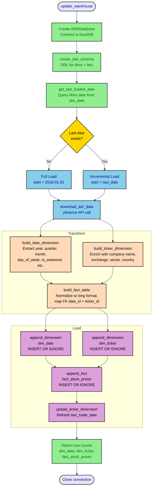
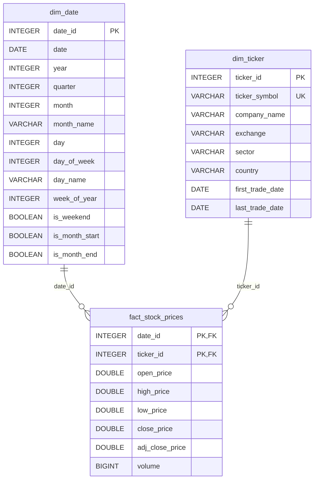

# adrs_warehouse

We're building a data warehouse model for the following US-listed argentine ADRs (American Depositary Receipt):

- "YPF",    # YPF S.A. (NYSE)
- "GGAL",   # Grupo Financiero Galicia (NASDAQ)
- "BMA",    # Banco Macro (NYSE)
- "BBAR",   # BBVA Argentina (NYSE)
- "PAM",    # Pampa Energia (NYSE)
- "TEO",    # Telecom Argentina (NYSE)
- "CEPU",   # Central Puerto (NYSE)
- "LOMA",   # Loma Negra (NYSE)
- "CRESY",  # Cresud (NASDAQ)
- "IRS",    # IRSA Inversiones (NYSE)
- "SUPV",   # Grupo Supervielle (NYSE)
- "MELI",   # MercadoLibre (NASDAQ)
- "BIOX",   # Bioceres Crop Solutions (NASDAQ)
  
Raw data is pulled from `yfinance` python package that wraps Yahoo Finance public available API. The resulting multilevel pandas dataframe is indexed by the date, in level 0 are the tickers and in level 1 the stock prices. The table is cleaned of missing values, and flattened to a long format. This flat DataFrame is persisted into a `duckdb` database.


## Workflow

The `update_warehouse` function orchestrates the full ETL pipeline: fetch from Yahoo Finance, build star-schema dimensions and fact table, and load incrementally into DuckDB.



## Database Schema

Star schema with two dimensions (`dim_date`, `dim_ticker`) and one fact table (`fact_stock_prices`). The composite primary key `(date_id, ticker_id)` in the fact table enforces one row per ticker per trading day.



## TODO
- [x] Implement a star schema for the database (dim_date, dim_ticker, fact_stock_prices)
- [x] Implement incremental data updates (fetch only new data since last load)
- [ ] Automate daily updates with a scheduler (cron, Prefect, or Airflow)
- [ ] Add function to include new tickers dynamically

## Possible Problems
- Yahoo Finance restricts the accesss to the python package, then the data shouod need to be accessed directly from the api
- The long format used in transformation could break memory bounds if many tickers and/or time intervals are considered

## Installation

```bash
uv sync              # install core dependencies
uv sync --extra dev  # include jupyter and dev tools
```

## Usage

```python
from adrs_warehouse.data.fetch import download_adr_data, build_ticker_dimension
from adrs_warehouse.data.transform import clean_data, normalize_prices_long
from adrs_warehouse.database.operations import ADRDatabase

# Download data
data = download_adr_data()

# Clean and transform
cleaned = clean_data(data)
long_format = normalize_prices_long(cleaned)

# Store in database
db = ADRDatabase("adr_data.db")
db.create_table_from_dataframe(long_format, "stock_prices")

# Query
results = db.query("SELECT * FROM stock_prices WHERE ticker = 'MELI' LIMIT 10")
```

## Update Functions

The warehouse supports incremental updates so only new data since the last load is fetched.

### `update_warehouse(db_path)`

Main entry point for keeping the warehouse up to date. Performs a full load when the database is empty, otherwise fetches only new dates.

```python
from adrs_warehouse.data.fetch import update_warehouse

# Run an incremental update (or full load on first run)
stats = update_warehouse("data/processed/db.duckdb")
# stats -> {"dim_date": 5, "dim_ticker": 0, "fact_stock_prices": 65}
```

### Database-level helpers

The `ADRDatabase` class exposes the lower-level methods used by `update_warehouse`:

| Method | Description |
|---|---|
| `get_last_loaded_date()` | Returns the most recent date in `dim_date`, or `None` if the table is empty. |
| `append_dimension(df, table_name)` | Appends new rows to a dimension table, skipping duplicates (`INSERT OR IGNORE`). Returns the number of rows added. |
| `append_fact(df)` | Appends new rows to `fact_stock_prices`, skipping duplicates. Returns the number of rows added. |
| `update_ticker_dimension(df)` | Updates `last_trade_date` on existing ticker rows with newer values. |

### Transform helpers

These functions build the star-schema tables from a cleaned long-format DataFrame:

| Function | Description |
|---|---|
| `build_date_dimension(df)` | Creates `dim_date` with derived attributes (year, quarter, month, day of week, weekend flags, etc.). |
| `build_ticker_dimension(df, metadata)` | Creates `dim_ticker` enriched with company name, exchange, sector, and country from config. |
| `build_fact_table(df, dim_date, dim_ticker)` | Creates `fact_stock_prices` with foreign keys to both dimensions. |

## Tests

Tests use **pytest** with mocked `yfinance` calls and an in-memory DuckDB database, so no network access or disk I/O is required.

### Running the test suite

```bash
uv run pytest -v              # all tests, verbose
uv run pytest -v -k fetch     # only fetch-related tests
uv run pytest -v -k transform # only transform-related tests
uv run pytest -v -k database  # only database-related tests
```

### Test structure

```
tests/
├── conftest.py          # shared fixtures (sample DataFrames, in-memory DB)
├── test_fetch.py        # download_adr_data, build_ticker_dimension (mocked yfinance)
├── test_transform.py    # clean_data, normalize_prices_long, dimension & fact builders
└── test_database.py     # star schema creation, incremental loads, update_warehouse integration
```

### Key fixtures (defined in `conftest.py`)

| Fixture | Description |
|---|---|
| `sample_multiindex_df` | 3-date x 2-ticker yfinance-like MultiIndex DataFrame. |
| `extended_multiindex_df` | Overlapping dates used to test incremental dedup logic. |
| `sample_long_df` | Long-format output of `normalize_prices_long`. |
| `db` | In-memory `ADRDatabase` with the star schema already created. |