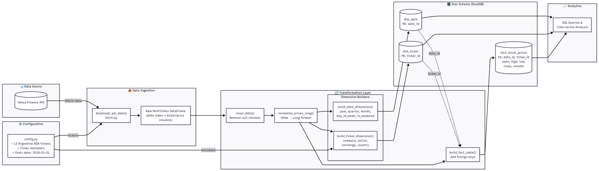

# adrs_warehouse

We're building a data warehouse model for the following US-listed argentine ADRs (American Depositary Receipt):

- "YPF",    # YPF S.A. (NYSE)
- "GGAL",   # Grupo Financiero Galicia (NASDAQ)
- "BMA",    # Banco Macro (NYSE)
- "BBAR",   # BBVA Argentina (NYSE)
- "PAM",    # Pampa Energia (NYSE)
- "TEO",    # Telecom Argentina (NYSE)
- "CEPU",   # Central Puerto (NYSE)
- "LOMA",   # Loma Negra (NYSE)
- "CRESY",  # Cresud (NASDAQ)
- "IRS",    # IRSA Inversiones (NYSE)
- "SUPV",   # Grupo Supervielle (NYSE)
- "MELI",   # MercadoLibre (NASDAQ)
- "BIOX",   # Bioceres Crop Solutions (NASDAQ)
  
Raw data is pulled from `yfinance` python package that wraps Yahoo Finance public available API. The resulting multilevel pandas dataframe is indexed by the date, in level 0 are the tickers and in level 1 the stock prices. The table is cleaned of missing values, and flattened to a long format. This flat DataFrame is persisted into a `duckdb` database.



## TODO
- [x] Implement a star schema for the database (dim_date, dim_ticker, fact_stock_prices)
- [ ] Implement incremental data updates (fetch only new data since last load)
- [ ] Automate daily updates with a scheduler (cron, Prefect, or Airflow)
- [ ] Add function to include new tickers dynamically

## Possible Problems
- Yahoo Finance restricts the accesss to the python package, then the data shouod need to be accessed directly from the api
- The long format used in transformation could break memory bounds if many tickers and/or time intervals are considered

## Installation

```bash
uv sync              # install core dependencies
uv sync --extra dev  # include jupyter and dev tools
```

## Tests

```bash
uv run pytest -v
```

## Usage

```python
from adrs_warehouse.data.fetch import download_adr_data, build_ticker_dimension
from adrs_warehouse.data.transform import clean_data, normalize_prices_long
from adrs_warehouse.database.operations import ADRDatabase

# Download data
data = download_adr_data()

# Clean and transform
cleaned = clean_data(data)
long_format = normalize_prices_long(cleaned)

# Store in database
db = ADRDatabase("adr_data.db")
db.create_table_from_dataframe(long_format, "stock_prices")

# Query
results = db.query("SELECT * FROM stock_prices WHERE ticker = 'MELI' LIMIT 10")
```