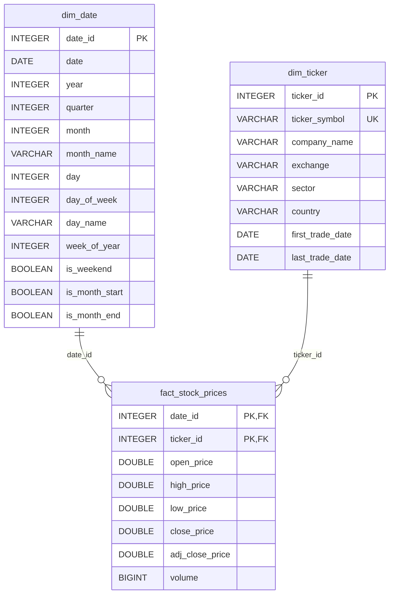

# adrs_warehouse


`adrs_warehouse` is a production-style data warehouse for the 13 US-listed Argentine ADRs (American Depositary Receipts). It fetches daily OHLC data from Yahoo Finance, transforms it into a star schema, and loads it incrementally into an embedded DuckDB database — with atomic transactions, data validation, and a scheduled CLI entry point.

**Stack:** Python 3.9+ · DuckDB · pandas · yfinance · pytest · GitHub Actions · uv

## Key Engineering Highlights

- **Star schema design** — `dim_date`, `dim_ticker`, and `fact_stock_prices` with composite primary keys enforcing one row per ticker per trading day.
- **Incremental ETL** — each run fetches only dates after `MAX(dim_date.date)`; full load on first run, idempotent on re-runs.
- **Atomic transactions** — all writes (dims + fact) are wrapped in a single transaction; any failure triggers a full rollback, leaving the DB consistent.
- **Abstract database backend** — a `DatabaseBackend` interface decouples the pipeline from DuckDB; alternative backends (MotherDuck, SQLite, Postgres) can be swapped in without touching any other code.
- **Data validation** — OHLC consistency checks, null detection, and non-negativity constraints run at both the transform stage and post-load via SQL; violation counts are returned in every run's result dict.
- **CI matrix** — GitHub Actions runs the full pytest suite on every push; coverage is enforced at ≥ 80%.
- **Structured logging** — `logging` with rotating file handler replaces `print`; log level and output path are configurable.
- **Cron automation** — a `[project.scripts]` CLI entry point (`adrs-warehouse`) integrates cleanly with cron for daily post-market updates.

## Tracked Tickers

Tracks 13 Argentine companies listed on NYSE and NASDAQ:

- `YPF`   — YPF S.A. (NYSE)
- `GGAL`  — Grupo Financiero Galicia (NASDAQ)
- `BMA`   — Banco Macro (NYSE)
- `BBAR`  — BBVA Argentina (NYSE)
- `PAM`   — Pampa Energia (NYSE)
- `TEO`   — Telecom Argentina (NYSE)
- `CEPU`  — Central Puerto (NYSE)
- `LOMA`  — Loma Negra (NYSE)
- `CRESY` — Cresud (NASDAQ)
- `IRS`   — IRSA Inversiones (NYSE)
- `SUPV`  — Grupo Supervielle (NYSE)
- `MELI`  — MercadoLibre (NASDAQ)
- `BIOX`  — Bioceres Crop Solutions (NASDAQ)

## Workflow

The `update_warehouse` function orchestrates the full ETL pipeline: fetch from Yahoo Finance, build star-schema dimensions and fact table, and load incrementally into DuckDB.

```mermaid
flowchart TD
    Start([update_warehouse]) --> InitDB[Create ADRDatabase<br>Connect to DuckDB]
    InitDB --> Schema[create_star_schema<br>DDL for dims + fact]
    Schema --> CheckDate[get_last_loaded_date<br>Query MAX date from dim_date]

    CheckDate --> HasData{Last date<br>exists?}
    HasData -->|No| FullLoad[Full Load<br>start = 2018-01-01]
    HasData -->|Yes| IncrLoad[Incremental Load<br>start = last_date]

    FullLoad --> Fetch
    IncrLoad --> Fetch

    Fetch[download_adr_data<br>yfinance API call]

    subgraph Transform
        direction TB
        T1[build_date_dimension<br>Extract year, quarter, month,<br>day_of_week, is_weekend, etc.]
        T2[build_ticker_dimension<br>Enrich with company name,<br>exchange, sector, country]
        T3[build_fact_table<br>Normalize to long format,<br>map FK date_id + ticker_id]
        T4[clean_fact_rows<br>Drop null OHLC, invalid ranges,<br>OHLC violations, duplicates]
    end

    Fetch --> T1
    Fetch --> T2
    T1 --> T3
    T2 --> T3
    T3 --> T4

    subgraph Load ["Load — atomic transaction"]
        direction TB
        LB[db.begin]
        L1[append_dimension<br>dim_date<br>INSERT OR IGNORE]
        L2[append_dimension<br>dim_ticker<br>INSERT OR IGNORE]
        L3[append_fact<br>fact_stock_prices<br>INSERT OR IGNORE]
        L4[update_ticker_dimension<br>Refresh last_trade_date]
        LC[db.commit]
        LR[db.rollback<br>re-raise]
    end

    L5[validate_fact_table<br>SQL checks: null OHLC,<br>OHLC violations, neg prices]

    T4 --> LB
    LB --> L1 --> L2 --> L3 --> L4 --> LC
    L3 -.->|exception| LR
    LC --> L5
    LR --> Close

    L5 --> Summary[Return row counts + violations<br>dim_date, dim_ticker,<br>fact_stock_prices, violations]
    Summary --> Close([Close connection — always via finally])

    classDef startEnd fill:#E6E6FA,stroke:#333,stroke-width:2px,color:darkblue
    classDef process fill:#90EE90,stroke:#333,stroke-width:2px,color:darkgreen
    classDef decision fill:#FFD700,stroke:#333,stroke-width:2px,color:black
    classDef extract fill:#87CEEB,stroke:#333,stroke-width:2px,color:darkblue
    classDef transform fill:#FFDAB9,stroke:#333,stroke-width:2px,color:black
    classDef load fill:#DDA0DD,stroke:#333,stroke-width:2px,color:black
    classDef validate fill:#FFB6C1,stroke:#333,stroke-width:2px,color:darkred
    classDef txn fill:#B8E0FF,stroke:#0066CC,stroke-width:2px,color:darkblue
    classDef rollback fill:#FFCCCC,stroke:#CC0000,stroke-width:2px,color:darkred

    class Start,Close startEnd
    class InitDB,Schema,CheckDate,Summary process
    class HasData decision
    class FullLoad,IncrLoad,Fetch extract
    class T1,T2,T3,T4 transform
    class L1,L2,L3,L4 load
    class L5 validate
    class LB,LC txn
    class LR rollback
```



## Database Schema

Star schema with two dimensions (`dim_date`, `dim_ticker`) and one fact table (`fact_stock_prices`). The composite primary key `(date_id, ticker_id)` in the fact table enforces one row per ticker per trading day.



## Pipeline Guarantees

- **Idempotence:** re-running the pipeline for an already-loaded date range inserts 0 rows.
- **Incrementality:** only dates strictly after `MAX(dim_date.date)` are fetched from the API
  on each run; the last loaded date is never re-downloaded.
- **Key stability:** `ticker_id` is assigned once based on the existing database mapping and
  never reassigned, even if the ticker list changes between runs.
- **Data quality:** after each load, OHLC consistency and non-negativity checks are run against
  the full fact table; counts are returned in the `violations` key of the result.
- **Atomicity:** all writes in a single run (dim_date, dim_ticker, fact_stock_prices) are
  wrapped in a single transaction; any failure triggers a full rollback.

## Installation

```bash
uv sync              # install core dependencies
uv sync --extra dev  # include jupyter and dev tools
```

After `uv sync`, the `adrs-warehouse` CLI is available via:

```bash
uv run adrs-warehouse --help
```

## Usage

### CLI

Run the incremental ETL pipeline from the command line:

```bash
uv run adrs-warehouse                                 # default db path
uv run adrs-warehouse --db-path /path/to/db.duckdb   # custom db path
uv run adrs-warehouse --help                          # show all options
```

### Python API

```python
from adrs_warehouse.data.fetch import update_warehouse

stats = update_warehouse("data/processed/db.duckdb")
```

## Adding a New Database Provider

The database layer uses an abstract `DatabaseBackend` interface, so alternative backends (MotherDuck, SQLite, Postgres, etc.) can be swapped in without changing any other code.

### Steps

1. **Create the backend class** in `adrs_warehouse/database/<provider>.py`, inheriting from `DatabaseBackend` and implementing all abstract methods:

```python
# adrs_warehouse/database/motherduck.py
from .base import DatabaseBackend

class MotherDuckDatabase(DatabaseBackend):
    def __init__(self, connection_string: str):
        import duckdb
        self.conn = duckdb.connect(connection_string)

    # implement all abstract methods ...
```

2. **Register it** in the `create_database` factory in `adrs_warehouse/database/operations.py`:

```python
def create_database(provider: str = "duckdb", **kwargs) -> DatabaseBackend:
    if provider == "duckdb":
        return DuckDBDatabase(**kwargs)
    if provider == "motherduck":
        from .motherduck import MotherDuckDatabase
        return MotherDuckDatabase(**kwargs)
    raise ValueError(f"Unknown database provider: {provider!r}")
```

3. **Use it** by passing a backend instance to `update_warehouse`:

```python
from adrs_warehouse.database import create_database
from adrs_warehouse.data.fetch import update_warehouse

db = create_database("motherduck", connection_string="md:my_db")
update_warehouse(db=db)
```

## Automated Updates (Cron)

The `adrs-warehouse` CLI (registered via `[project.scripts]` in `pyproject.toml`) runs the incremental ETL pipeline and exits with a zero status code on success, making it a natural fit for cron scheduling. The logger writes structured output to `logs/adrs_warehouse.log` automatically.

### Setting Up a Cron Job

The steps below work on Linux and macOS.

**Step 1 — Find the installed command path**

From the project root, print the absolute path to the binary:

```bash
which adrs-warehouse          # if the venv is already activated
# or
echo "$(pwd)/.venv/bin/adrs-warehouse"   # always works from the project root
```

Copy the full path — you will paste it into the crontab entry.

**Step 2 — Open the crontab editor**

```bash
crontab -e
```

This opens your personal crontab in `$EDITOR` (usually `vi` or `nano`).

**Step 3 — Understand cron syntax**

```
# ┌─ minute  (0-59)
# │ ┌─ hour   (0-23)
# │ │ ┌─ day-of-month (1-31)
# │ │ │ ┌─ month (1-12)
# │ │ │ │ ┌─ day-of-week (0-7, 0 and 7 = Sunday)
# │ │ │ │ │
# * * * * *  command
```

**Step 4 — Add the cron entry**

Replace `/path/to/project` with your actual project root (from Step 1):

```
# Update ADR warehouse weekdays at 6 PM — after NYSE closes at 4 PM ET
0 18 * * 1-5 /path/to/project/.venv/bin/adrs-warehouse --db-path /path/to/project/data/processed/db.duckdb >> /path/to/project/logs/cron.log 2>&1
```

> **PATH caveat:** Cron runs with a minimal `PATH` that does not include your venv. Always use the absolute path to the binary rather than a bare `adrs-warehouse`. Alternatively, set `PATH` at the top of the crontab:
> ```
> PATH=/path/to/project/.venv/bin:/usr/local/bin:/usr/bin:/bin
> ```

Make sure the `logs/` directory exists before the first run:

```bash
mkdir -p /path/to/project/logs
```

**Step 5 — Verify the cron job is registered**

```bash
crontab -l
```

**Step 6 — Check the logs after the first run**

The app writes structured lines to `logs/adrs_warehouse.log` (rotating at 5 MB, 3 backups). The cron redirect appends stdout/stderr to `logs/cron.log`:

```bash
tail -f /path/to/project/logs/adrs_warehouse.log
tail -f /path/to/project/logs/cron.log
```

A successful run ends with:

```
Update complete — dim_date: 5, dim_ticker: 0, fact_stock_prices: 65
```

## Update Functions

The warehouse supports incremental updates so only new data since the last load is fetched.

### `update_warehouse(db_path)`

Main entry point for keeping the warehouse up to date. Performs a full load when the database is empty, otherwise fetches only new dates.

```python
from adrs_warehouse.data.fetch import update_warehouse

# Run an incremental update (or full load on first run)
stats = update_warehouse("data/processed/db.duckdb")
# stats -> {
#     "dim_date": 5,
#     "dim_ticker": 0,
#     "fact_stock_prices": 65,
#     "violations": {
#         "null_required_fields": 0,
#         "ohlc_violations": 0,
#         "negative_prices": 0,
#         "negative_volume": 0,
#     }
# }
```

### Database-level helpers

The `ADRDatabase` class exposes the lower-level methods used by `update_warehouse`:

| Method | Description |
|---|---|
| `get_last_loaded_date()` | Returns the most recent date in `dim_date`, or `None` if the table is empty. |
| `begin()` | Opens an explicit transaction. Called before the four load writes. |
| `commit()` | Commits the current transaction on success. |
| `rollback()` | Rolls back the current transaction on any write failure, leaving the DB unchanged. |
| `append_dimension(df, table_name)` | Appends new rows to a dimension table, skipping duplicates (`INSERT OR IGNORE`). Returns the number of rows added. |
| `append_fact(df)` | Appends new rows to `fact_stock_prices`, skipping duplicates. Returns the number of rows added. |
| `update_ticker_dimension(df)` | Updates `last_trade_date` on existing ticker rows with newer values. |
| `validate_fact_table()` | Runs four SQL data-quality checks on `fact_stock_prices` after the transaction commits. Returns a `dict[str, int]` of violation counts; logs a warning for any non-zero count. |

### Transform helpers

These functions build the star-schema tables from a cleaned long-format DataFrame:

| Function | Description |
|---|---|
| `build_date_dimension(df)` | Creates `dim_date` with derived attributes (year, quarter, month, day of week, weekend flags, etc.). |
| `build_ticker_dimension(df, metadata)` | Creates `dim_ticker` enriched with company name, exchange, sector, and country from config. |
| `build_fact_table(df, dim_date, dim_ticker)` | Creates `fact_stock_prices` with foreign keys to both dimensions. |
| `clean_fact_rows(df)` | Drops rows failing any of four checks: null required OHLC fields, OHLC logical violations, negative/zero prices or negative volume, and duplicate `(date_id, ticker_id)` pairs. Called inside `build_fact_table()`. |

## Tests

Tests use **pytest** with mocked `yfinance` calls and an in-memory DuckDB database, so no network access or disk I/O is required.

### Running the test suite

```bash
uv run pytest -v              # all tests, verbose
uv run pytest -v -k fetch     # only fetch-related tests
uv run pytest -v -k transform # only transform-related tests
uv run pytest -v -k database  # only database-related tests
```

### Coverage

Coverage is measured automatically on every test run (configured via `addopts` in `pyproject.toml`) and a summary is printed to the terminal. To get a full HTML report instead:

```bash
uv run pytest --cov-report=html   # writes htmlcov/index.html
open htmlcov/index.html           # open in browser (macOS)
xdg-open htmlcov/index.html       # open in browser (Linux)
```

To check coverage for a single module:

```bash
uv run pytest --cov=adrs_warehouse/data/transform.py
```

`adrs_warehouse/utils/helpers.py` is excluded from coverage (see `[tool.coverage.run]` in `pyproject.toml`).

### Test structure

```
tests/
├── conftest.py          # shared fixtures (sample DataFrames, in-memory DB)
├── test_fetch.py        # download_adr_data, build_ticker_dimension (mocked yfinance)
├── test_transform.py    # clean_data, normalize_prices_long, dimension & fact builders
├── test_database.py     # star schema creation, incremental loads, update_warehouse integration
└── test_logging.py      # setup_logging: handler wiring, idempotence, log directory creation
```

### Key fixtures (defined in `conftest.py`)

| Fixture | Description |
|---|---|
| `sample_multiindex_df` | 3-date x 2-ticker yfinance-like MultiIndex DataFrame. |
| `extended_multiindex_df` | Overlapping dates used to test incremental dedup logic. |
| `sample_long_df` | Long-format output of `normalize_prices_long`. |
| `db` | In-memory `ADRDatabase` with the star schema already created. |

## Limitations

- Yahoo Finance restricts access to the Python package periodically; in that case data may need to be fetched directly from the API.
- The long-format transformation loads the full date range into memory; for very large ticker lists or long time windows this could exceed available RAM.

## Roadmap

Here's where the project stands and what's next:

### Data pipeline
- [x] Implement a star schema for the database (dim_date, dim_ticker, fact_stock_prices)
- [x] Implement incremental data updates (fetch only new data since last load)
- [x] Automate daily updates with a scheduler (cron)
- [x] Validate loaded data (price ranges, volume ≥ 0, high ≥ low) and log dropped rows
- [ ] Add function to include new tickers dynamically
- [x] Wrap pipeline steps in a transaction so partial failures leave the DB consistent
- [ ] Add retry logic with exponential backoff for yfinance API failures

### Code quality
- [x] Replace `print()` calls with structured `logging` (log levels, file output)
- [x] Remove unused imports (`pathlib.Path` in `fetch.py`)
- [ ] Add error handling around API calls and database operations
- [ ] Complete type hints on all public functions and replace plain `dict` metadata with `TypedDict`

### Testing & CI
- [x] Add GitHub Actions workflow to run pytest on every push
- [x] Add edge-case tests: overlapping date ranges, sparse ticker data
- [x] Add `pytest --cov` and enforce ≥ 80% coverage
- [x] Add edge-case test: empty API response
